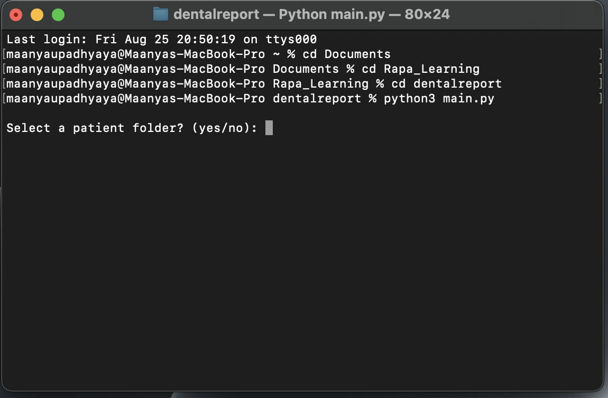
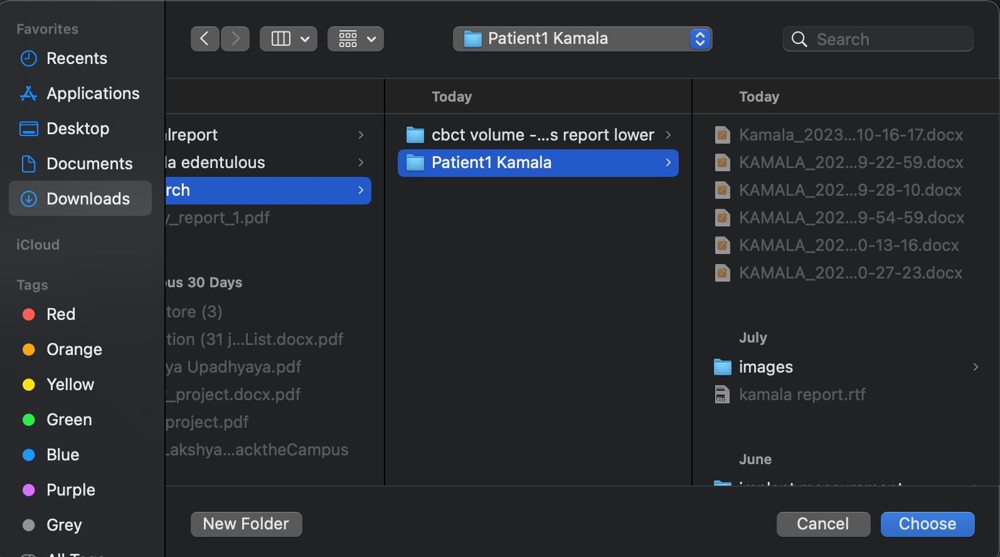
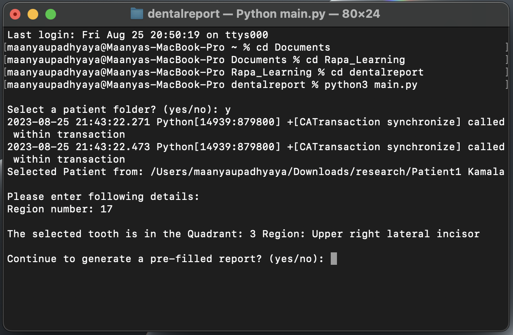
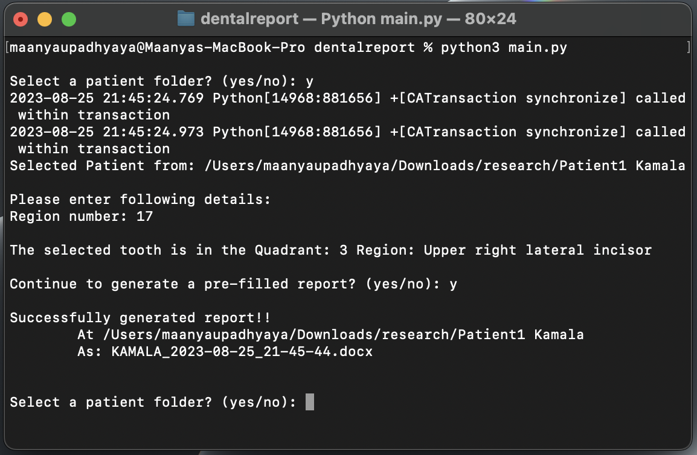
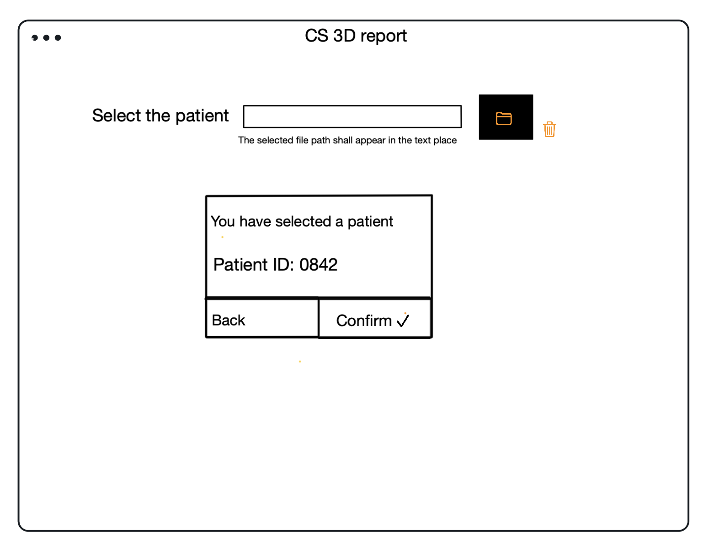
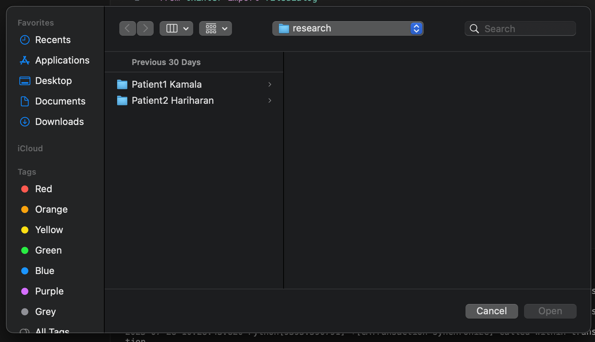
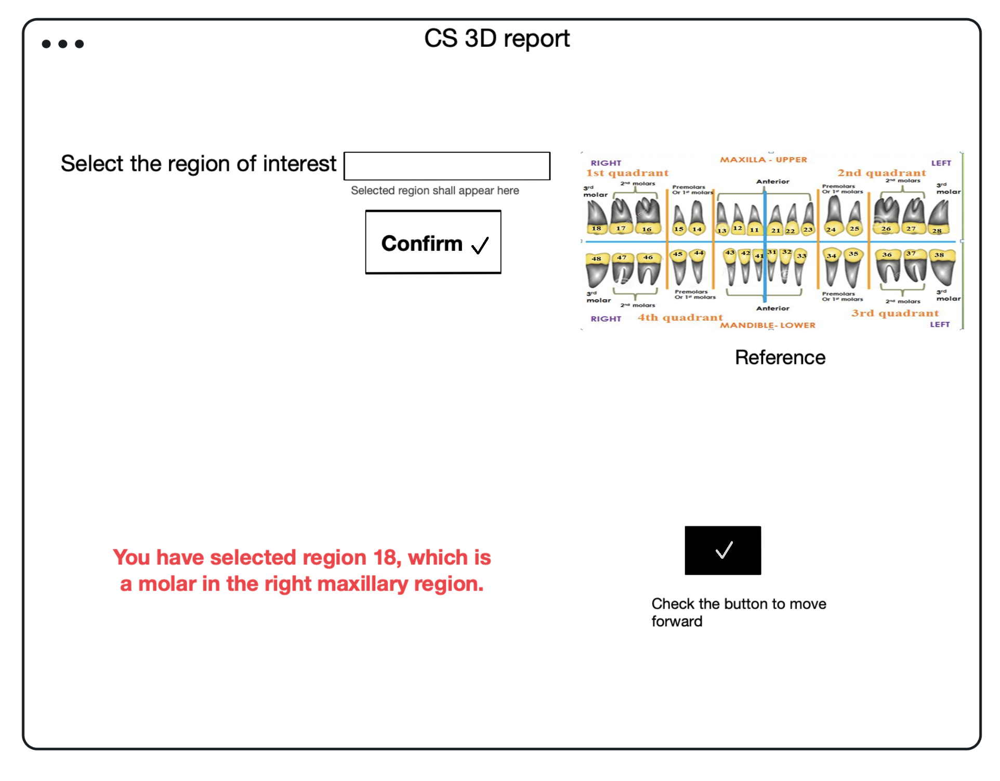
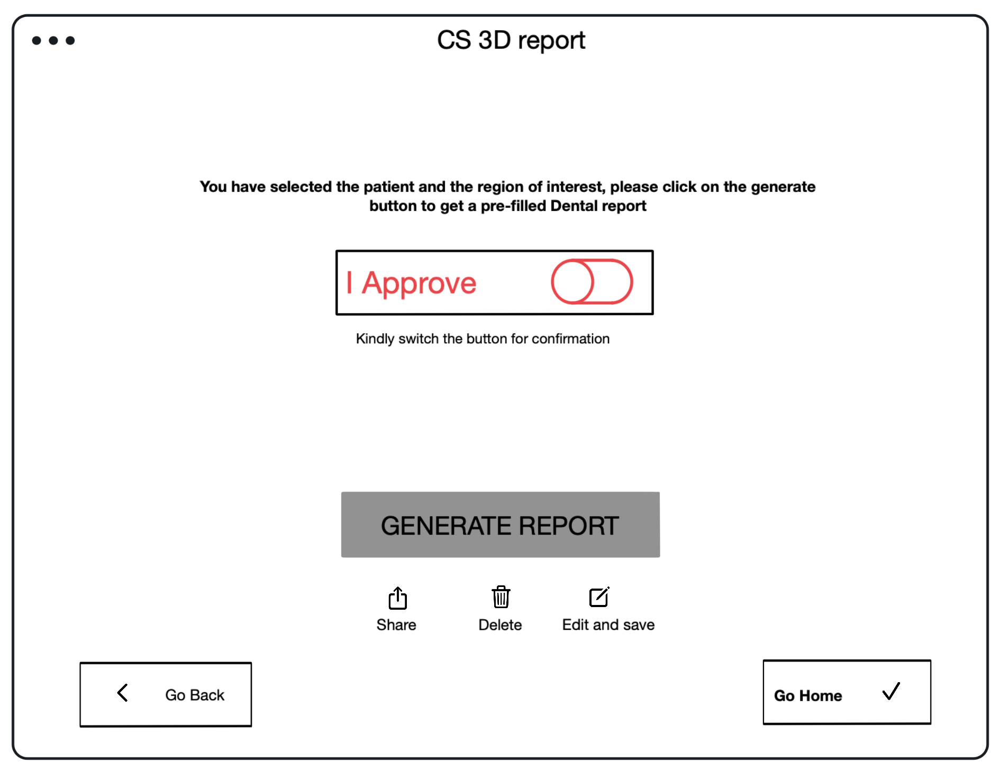
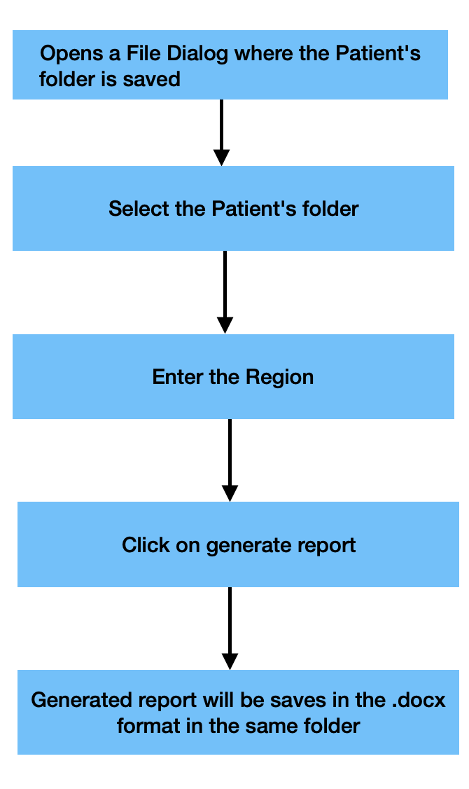

# Care Stream 3D Auto Report Generation
## INTRODUCTION

CareStream 3D is a 3D imaging software used by dentists to find the anomaly in the patient's teeth. The software gives a clear 3D view of the oral bones. Based on the anamoly the software could be used in different ways. 

For downloading the software please visit :👉🏻https://www.carestreamdental.com/en-in/csd-products/software/imaging-software/cs-3d-imaging-software/

NOTE : This software is not supported under MacOS

The project aims to perform an automation for the report generation as to try and reduce human intervention. Once the scan is done the images formed are to be processed, marked, dimensionalized and correctly  mapped to be put in the report. This part used to require a human assistance, but with the project in hand it becomes very east and error-free.

## Table of Contents

| Index | Content                |
|-------|---------------------   |
| 1     | [Purpose](#purpose)    |
| 2     | [Approach](#approach)  |
| 3     | [Workflow](#workflow)  |
| 4     | [Installation](#installation)|
| 5     | [Console-based](#console)|
| 6     | [UI-Mock](#ui)           |
| 7     | [Flowchart](#flowchart)  |  

## PURPOSE:

The entries in a typical dental report has the following:

* Patient related information
* Details of the study performed
* Analysis of the problem by the technician/doctor
* Observations by the doctor regarding the anamoly.

It would be more efficient for the doctors if filling of these details are automated.

## APPROACH:

The automation will be handled in the steps given below:

Step 1: Automate filling of patient and study related information through console based software

Step 2: Convert the above to a UI based software.

Step 3: An AI automation for canal tracking.

## Workflow:

*  User selects a patient name as thier folder.
*  User selects a region
*  Chooses to generate report
*  A new pre filled report will be generated and saved in the respective patient's file.

## Installation Details: 

1. python installation 

2. packages required for the project to run

| Modules     | Commands for installation                  |
|----------   |--------------------------------------------|
| pydicom     | pip install pydicom                        |
| openCV      | pip install opencv-python                  |
| numpy       | pip install numpy                          |
| Pillow      | pip install pillow                         |
| Docxtypl    | pip install docxtpl                        |

On Ubuntu, you may have to additionally do the following:

`apt-get update && apt-get install libgl1`

3. Run python main.py

## Console-based Workflow:

In the console based version of the software, the user shall interact via the console of the IDE they choose to run the code on. 

Step 1: When the command python main.py is executed the following shall appear on the terminal.The user is asked if he/she wants to to select a file, if yes a file dialog shall open for choosing the patient's file.

Step 2: The user is asked to enter the Region of Intrest.A pop up window with the standard FDI teeth numbering shall appear for reference in case of error.

Step 3: The user is asked they want to generate a pre filled report. On typing 'yes' a report shall be generated and saved in docx format in the same folder under the patient's name along with date and time.

## UI Mock:

Lets look into the workflow in detail

Step 1: When we run the python file, an UI opens like this

Step 2: User is requested to chose the patient folder from a file dialog 

A confirmation is asked for the patient's name and details within the same form. Click on confirm to move to the next step.

Step 3: Using the picture as the reference, choose the region of interest.

Step 4: When your region of interst is confirmed let’s move towards the final strep of generating a pre-filled report.
Click on Generate Report button and the report generated will be in .docx format, editable further by the technicians/doctor.

Step 5: Once the report is generated you can return to the home page via the home button or close the UI.

## FLOWCHART :

The final pictorial view of the steps for the generation of the pre-filled report is as follows:

